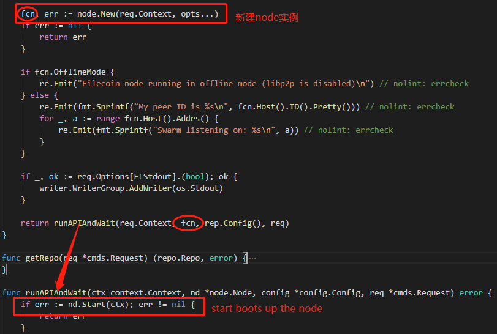

## 目录
- filecoin源码协议层分析之hello握手协议
    -   1. [目的](#目的)
    -   2. [源码信息](#源码信息)
    - 3. [源码分析](源码分析)
    
      - 3.1 [数据结构](#数据结构)
      - 3.2 [方法](#方法)
      
    -   4. [实例化及业务逻辑](#实例化及业务逻辑)

## 1.目的

- Hello协议负责节点上线后的区块同步


## 2.源码信息

- version
- package
- location


## 3.源码分析

### 3.1数据结构

- 获取协议名称

```go
// protocol is the libp2p protocol identifier for the hello protocol.
func helloProtocol(networkName string) protocol.ID {
	return protocol.ID(fmt.Sprintf("/fil/hello/%s", networkName))
}
```

- 日志标识

```go
var log = logging.Logger("/fil/hello")
```

- 定义hello协议中单个消息的数据结构
  - tipset切片（cid集合） 
    - tipset概念：Filecoin的共识算法叫Expected Consensus，简称EC共识机制。Expected Consensus每一轮会生成一个Ticket，每个节点通过一定的计算，确定是否是该轮的Leader。如果选为Leader，节点可以打包区块。也就是说，每一轮可能没有Leader（所有节点都不符合Leader的条件），或者多个Leader（有多个节点符合Leader）。Filecoin使用TipSet的概念，表明一轮中多个Leader产生的指向同一个父亲区块的区块集合。
  - 最重的tipset（主链）的高度
  - 创世区块cid

```go
// Message is the data structure of a single message in the hello protocol.
type Message struct {
	HeaviestTipSetCids   types.TipSetKey
	HeaviestTipSetHeight uint64
	GenesisHash          cid.Cid
}
// TipSetKey is an immutable set of CIDs forming a unique key for a TipSet.
// Equal keys will have equivalent iteration order, but note that the CIDs are *not* maintained in
// the same order as the canonical iteration order of blocks in a tipset (which is by ticket).
// TipSetKey is a lightweight value type; passing by pointer is usually unnecessary.
type TipSetKey struct {
	// The slice is wrapped in a struct to enforce immutability.
	cids []cid.Cid
}
```

- Handler结构体,当有Node连接到自己时(1)会发送包含本节点信息的hello 消息给对方; (2) 对端会回复一个包含对端节点信息的消息体过来
  - host对应libp2p上的主机
  - 创世区块cid
  - 区块同步回调函数
  - 检索当前最重的tipset
  - 网络名称

```go
type Handler struct {
	host host.Host

	genesis cid.Cid

	// callBack is called when new peers tell us about their chain
	callBack helloCallback

	//  is used to retrieve the current heaviest tipset
	// for filling out our hello messages.
	getHeaviestTipSet getTipSetFunc

	networkName string
}
```

### 3.2 方法

#### 3.2.1 Handler方法

- handleNewStream流函数处理，响应远端节点的连接，回复hello消息体

```go
func (h *Handler) handleNewStream(s net.Stream) {
	defer s.Close() // nolint: errcheck
	if err := h.sendHello(s); err != nil {
		log.Debugf("failed to send hello message:%s", err)
	}
	return
}
// sendHello send a hello message on stream `s`.
func (h *Handler) sendHello(s net.Stream) error {
	//获取本节点的hello消息体
	msg, err := h.getOurHelloMessage()
	if err != nil {
		return err
	}
	//向远端节点发送hello消息体
	return cbu.NewMsgWriter(s).WriteMsg(&msg)
}

func (h *Handler) getOurHelloMessage() (*Message, error) {
	heaviest, err := h.getHeaviestTipSet()
	if err != nil {
		return nil, err
	}
	height, err := heaviest.Height()
	if err != nil {
		return nil, err
	}

	return &Message{
		GenesisHash:          h.genesis,
		HeaviestTipSetCids:   heaviest.Key(),
		HeaviestTipSetHeight: height,
	}, nil
}
```

- ReceiveHello：接收来自对等节点的hello消息体

```go
func (h *Handler) ReceiveHello(ctx context.Context, p peer.ID) (*Message, error) {
	s, err := h.host.NewStream(ctx, p, helloProtocol(h.networkName))
	if err != nil {
		return nil, err
	}
	defer func() { _ = s.Close() }()

	var hello Message
	if err := cbu.NewMsgReader(s).ReadMsg(&hello); err != nil {
		helloMsgErrCt.Inc(ctx, 1)
		return nil, err
	}
	return &hello, nil
}
```

- processHelloMessage：处理ReceiveHello获取的msg，构造关于对等节点链的元数据信息(ChainInfo结构体)

```go
func (h *Handler) processHelloMessage(from peer.ID, msg *Message) (*types.ChainInfo, error) {
	if !msg.GenesisHash.Equals(h.genesis) {
		return nil, ErrBadGenesis
	}

	return types.NewChainInfo(from, msg.HeaviestTipSetCids, msg.HeaviestTipSetHeight), nil
}
```


#### 3.2.2 helloNotify方法

- hello方法， 返回一个handle实例。

```go
func (hn *helloNotify) hello() *Handler {
	return (*Handler)(hn)
}
```

- Connected是连接到libp2p节点时触发的回调方法，它将从连接中读取一条hello消息，如果校验失败则终止连接，成功则将消息传递给它的处理程序回调函数。

```go
func (hn *helloNotify) Connected(n net.Network, c net.Conn) {
	go func() {
		ctx, cancel := context.WithTimeout(context.Background(), helloTimeout)
		defer cancel()

		// receive the hello message
		from := c.RemotePeer()
		hello, err := hn.hello().ReceiveHello(ctx, from)
		if err != nil {
			log.Debugf("failed to receive hello handshake from peer %s: %s", from, err)
			return
		}
		//根据获取的hello消息,构造关于对等节点链的元数据信息
		ci, err := hn.hello().processHelloMessage(from, hello)
		switch {
		//如果校验失败则终止连接
		case err == ErrBadGenesis:
			log.Debugf("genesis cid: %s does not match: %s, disconnecting from peer: %s", &hello.GenesisHash, hn.hello().genesis, from)
			genesisErrCt.Inc(context.TODO(), 1)
			_ = c.Close()
			return
		//成功则将消息传递给它的处理程序回调函数(helloCallback)
		case err == nil:
			hn.hello().callBack(ci)
		default:
			log.Error(err)
		}
	}()
}

func (hn *helloNotify) Listen(n net.Network, a ma.Multiaddr)      {}
func (hn *helloNotify) ListenClose(n net.Network, a ma.Multiaddr) {}
func (hn *helloNotify) Disconnected(n net.Network, c net.Conn)    {}
func (hn *helloNotify) OpenedStream(n net.Network, s net.Stream)  {}
func (hn *helloNotify) ClosedStream(n net.Network, s net.Stream)  {}
```

- helloNotify实现了libp2p-net/interface.go中的Notifiee接口

```go
//上文中的helloNotify 实现了libp2p-net/interface.go中的Notifiee接口
// Notifiee is an interface for an object wishing to receive
// notifications from a Network.
type Notifiee interface {
	Listen(Network, ma.Multiaddr)      // called when network starts listening on an addr
	ListenClose(Network, ma.Multiaddr) // called when network stops listening on an addr
	Connected(Network, Conn)           // called when a connection opened
	Disconnected(Network, Conn)        // called when a connection closed
	OpenedStream(Network, Stream)      // called when a stream opened
	ClosedStream(Network, Stream)      // called when a stream closed

	// TODO
	// PeerConnected(Network, peer.ID)    // called when a peer connected
	// PeerDisconnected(Network, peer.ID) // called when a peer disconnected
}
```


#### 3.3 函数

- 创建hello协议实例并将其注册到给定的host，带有提供的回调

```go
// New creates a new instance of the hello protocol and registers it to
// the given host, with the provided callbacks.
func New(h host.Host, gen cid.Cid, helloCallback helloCallback, getHeaviestTipSet getTipSetFunc, net string) *Handler {
	hello := &Handler{
		host:              h,
		genesis:           gen,
		callBack:          helloCallback,
		getHeaviestTipSet: getHeaviestTipSet,
		networkName:       net,
	}
	//设置流处理回调函数
	h.SetStreamHandler(helloProtocol(net), hello.handleNewStream)
   
	// register for connection notifications(注册网络状态改变通知回调函数)
	h.Network().Notify((*helloNotify)(hello))

	return hello
}
```


## 4.实例化及业务逻辑

- location: commands/daemon.go
- 函数daemonRun( )



- location: node/node.go
- Node中定义了HelloProtocol

```go
type Node struct {
    ...
	HelloProtocol     HelloProtocolSubmodule
    ...
}

// HelloProtocolSubmodule enhances the `Node` with "Hello" protocol capabilities.
type HelloProtocolSubmodule struct {
	HelloSvc *hello.Handler
}
```

- 启动hello服务

```go
// Start boots up the node.
func (node *Node) Start(ctx context.Context) error {
    ...
		// 定义区块同步的回调函数
		helloCallback := func(ci *types.ChainInfo) {
			node.Network.PeerTracker.Track(ci)
			// TODO Implement principled trusting of ChainInfo's
			trusted := true
			// 触发调用会启动区块同步的动作
			err := node.Chain.Syncer.HandleNewTipSet(context.Background(), ci, trusted)
			if err != nil {
				log.Infof("error handling tipset from hello %s: %s", ci, err)
				return
			}
			node.Chain.ChainSynced.Done()
		}
		//实例化hello服务
		node.HelloProtocol.HelloSvc = hello.New(node.Host(), node.Chain.ChainReader.GenesisCid(), helloCallback, node.PorcelainAPI.ChainHead, node.Network.NetworkName)
}
```

