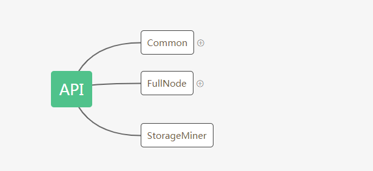
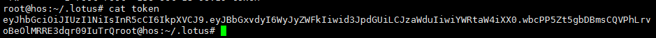

## API

### 1.结构：



### 2.api包概述

1. Common ：定义了基本的方法
2. FullNode：定义了全节点具有的方法
3. StorageMiner：定义了存储矿工具有的方法

### 3.代码详解

#### Common

```go
//*****Auth*****
//权限校验
AuthVerify(ctx context.Context, token string) ([]string, error)
//生成jwt令牌
AuthNew(ctx context.Context, perms []string) ([]byte, error)
...
```

#### FullNode

```go
Common
//*****chain*****
ChainNotify(context.Context) (<-chan []*store.HeadChange, error)
ChainHead(context.Context) (*types.TipSet, error)
ChainGetRandomness(context.Context, *types.TipSet, []*types.Ticket, int) ([]byte, error)
ChainGetBlock(context.Context, cid.Cid) (*types.BlockHeader, error)
ChainGetTipSet(context.Context, []cid.Cid) (*types.TipSet, error)
ChainGetBlockMessages(context.Context, cid.Cid) (*BlockMessages, error)
ChainGetParentReceipts(context.Context, cid.Cid) ([]*types.MessageReceipt, error)
ChainGetParentMessages(context.Context, cid.Cid) ([]Message, error)
ChainGetTipSetByHeight(context.Context, uint64, *types.TipSet) (*types.TipSet, error)
ChainReadObj(context.Context, cid.Cid) ([]byte, error)
ChainSetHead(context.Context, *types.TipSet) error
ChainGetGenesis(context.Context) (*types.TipSet, error)
ChainTipSetWeight(context.Context, *types.TipSet) (types.BigInt, error)

//*****syncer*****
SyncState(context.Context) (*SyncState, error)
SyncSubmitBlock(ctx context.Context, blk *types.BlockMsg) error
....
```

#### StorageMiner

```go
Common
ActorAddress(context.Context) (address.Address, error)
StoreGarbageData(context.Context) (uint64, error)
SectorsStatus(context.Context, uint64) (sectorbuilder.SectorSealingStatus, error)
SectorsList(context.Context) ([]uint64, error)
SectorsStagedSeal(context.Context) error
SectorsRefs(context.Context) (map[string][]SealedRef, error)
```

#### 权限逻辑

cli/auth.go：创建具有所有权限的token令牌

```go
const (
	// When changing these, update docs/API.md too

	PermRead  = "read" // default
	PermWrite = "write"
	PermSign  = "sign"  // Use wallet keys for signing
	PermAdmin = "admin" // Manage permissions
)
var authCreateAdminToken = &cli.Command{
	Name:  "create-admin-token",
	Usage: "Create admin token",
	Action: func(cctx *cli.Context) error {
		napi, closer, err := GetFullNodeAPI(cctx)
		if err != nil {
			return err
		}
		defer closer()

		ctx := ReqContext(cctx)

		// TODO: Probably tell the user how powerful this token is
		//具有所有权限的token
		token, err := napi.AuthNew(ctx, api.AllPermissions)
		if err != nil {
			return err
		}

		// TODO: Log in audit log when it is implemented

		fmt.Println(string(token))
		return nil
	},
}
```

- 令牌(token)校验：校验此tokan有什么权限（对应上面的四种权限）操作方法

```go
func (a *CommonAPI) AuthVerify(ctx context.Context, token string) ([]string, error) {
	var payload jwtPayload
	if _, err := jwt.Verify([]byte(token), (*jwt.HMACSHA)(a.APISecret), &payload); err != nil {
		return nil, xerrors.Errorf("JWT Verification failed: %w", err)
	}

	return payload.Allow, nil
}
```

- 在下面两个函数中将fullnode和storage-miner中的方法注册到了rpc服务中，并具有权限拦截器

- location：cmd/lotus/daemon.go

```go
return serveRPC(api, stop, "127.0.0.1:"+cctx.String("api"))

//location：cmd/lotus/rpc.go  method:serveRPC
func serveRPC(a api.FullNode, stop node.StopFunc, addr string) error {
	rpcServer := jsonrpc.NewServer()
	rpcServer.Register("Filecoin", api.PermissionedFullAPI(a))

	ah := &auth.Handler{
		Verify: a.AuthVerify,
		Next:   rpcServer.ServeHTTP,
	}
    ....
}
```

- location：cmd/lotus-storage-miner/run.go

```go
rpcServer.Register("Filecoin", api.PermissionedStorMinerAPI(minerapi))

ah := &auth.Handler{
    Verify: minerapi.AuthVerify,
    Next:   rpcServer.ServeHTTP,
}
```

#### JWT

 JWT包含三个由点分隔的部分 



- Header（头部）
  Header通常由两部分组成：令牌的类型，即JWT。和用于签名加密的算法名称，如HMAC SHA256或RSA。Header部分的JSON被Base64Url编码，形成JWT的第一部分 
-  Payload（载荷）
  Payload中放传输的信息，用户信息等用于传输的信息。Playload部分的JSON被Base64Url编码，形成JWT的第二部分。 
-  Signature（签名）
  Signature用来验证发送请求者身份，由前两部分加密形成。要创建签名部分，您必须采用编码标头，编码有效载荷，秘钥，标头中指定的算法并签名。Signature部分的JSON被Base64Url编码，形成JWT的第三部分。 